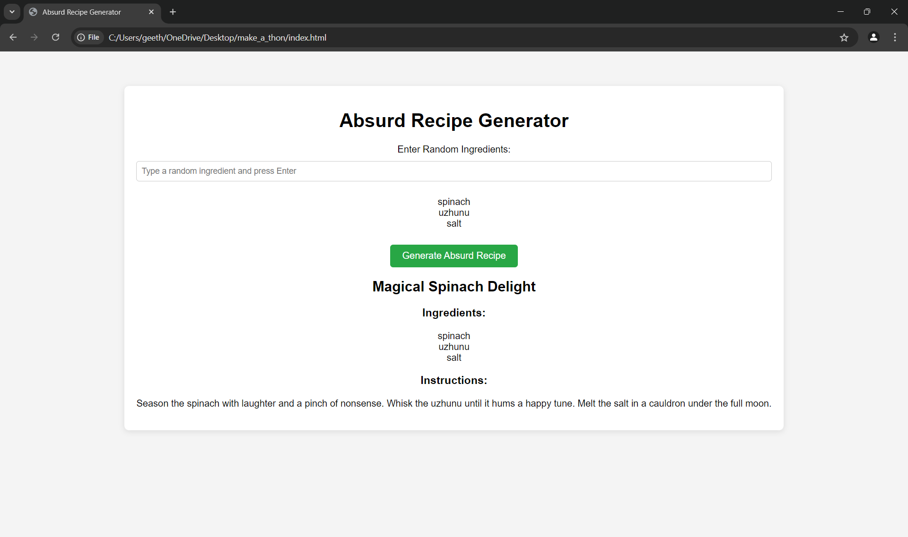
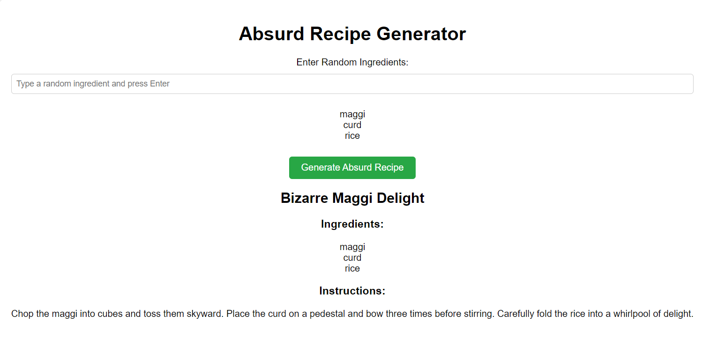
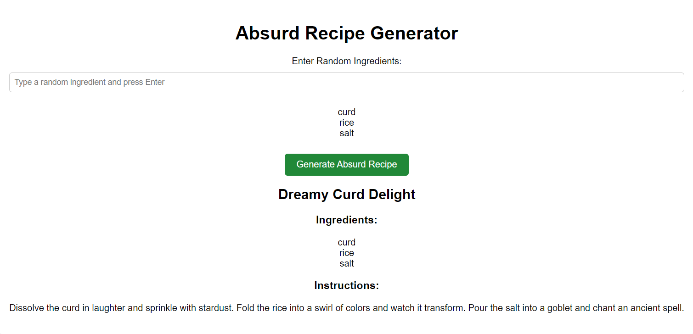

Absurd Recipe Generator 🍲

Basic Details

Team Name: BEAST

Team Members

    Team Lead: AKSHAY S - RIT KOTTAYAM
    Member 2: GEETHUL KRISHNA G D - RIT KOTTAYAM

Project Description

    The Absurd Recipe Generator is a playful web app that takes random ingredients entered by the user and generates a ridiculous recipe name, quirky instructions, and cooking steps that no sane chef would ever follow. Perfect for the culinary thrill-seeker!

The Problem (that doesn’t exist)

    Do you ever get tired of logical recipes? Are you looking for some nonsensical steps in your cooking routine? There’s an untapped market for absurd cooking instructions that make absolutely no sense!

The Solution (that nobody asked for)
    
    With our Absurd Recipe Generator, you can enter random ingredients, and we’ll provide an imaginary recipe title and surreal instructions, making you feel like the star chef of a culinary fever dream. Toss your ingredients to the sky, whisk them with magic, and sauté with stardust!

Technical Details

Technologies/Components Used

    For Software:

        Languages: HTML, CSS, JavaScript
        Tools: Git for version control, GitHub Pages for deployment

Implementation

    For Software:

        Installation

            # Clone the repository
            git clone https://github.com/Gk070/project/AbsurdRecipeGenerator.git
            cd AbsurdRecipeGenerator

        Run

            1. Open index.html in your favorite web browser

Project Documentation

    For Software:

        Screenshots

            
            
            

        Diagrams

             

Team Contributions

    AKSHAY S : Designed the user interface, contributed absurd ingredient ideas, and handled the project documentation. 
    GEETHUL KRISHNA G D : Wrote and designed the recipe name generator and contributed to the whimsical vocabulary for the instructions. 